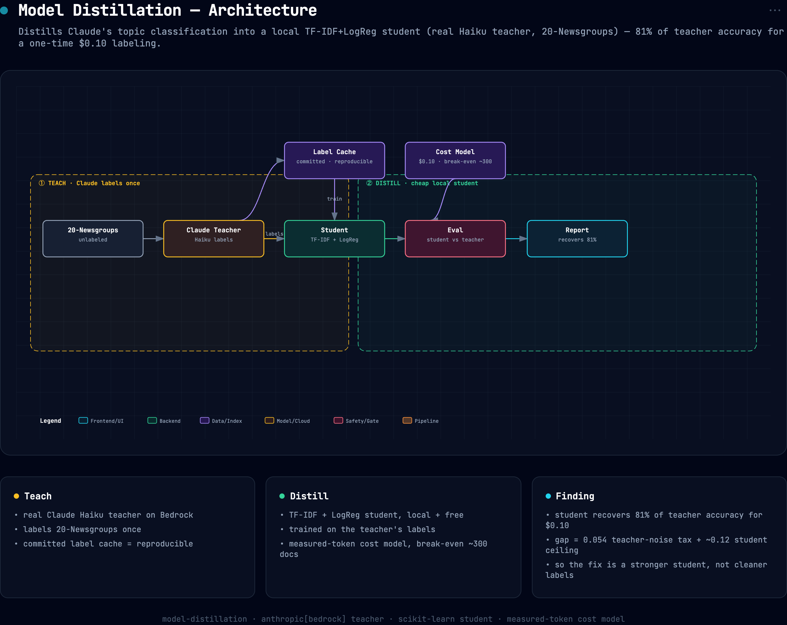

# model-distillation

**Distill Claude's topic-classification behavior into a local TF-IDF + logistic-regression student,
then measure the three numbers that decide whether distillation is worth it:** how much quality
survives, what learning from an imperfect teacher costs, and when the distilled student pays for
itself.

```bash
pip install -e ".[dev,real]"
model-distillation                       # real Claude teacher on Bedrock (uses committed label cache)
model-distillation --n-train 300 --n-test 150
model-distillation --offline             # fake teacher, no keys — pipeline demo only
pytest -q                                # offline tests — fake teacher + local student, no keys
```

The task is real text: a 4-category slice of **20 Newsgroups** (`med` / `space` / `autos` /
`graphics`), headers/footers/quotes stripped so it's genuine content classification with real gold
labels. The teacher (Claude Haiku) labels each document zero-shot; the student learns only from the
teacher's labels; both are scored against the held-out gold set. Teacher labels are cached to
`data/teacher_labels.json` (committed), so the exact numbers reproduce for free, deleting the cache
re-runs the real Claude calls.


## Architecture



*Interactive/exportable version: [`docs/assets/architecture.html`](docs/assets/architecture.html).*

## Results (real run: Claude Haiku 4.5 on Bedrock, 300 train / 150 test)

| | accuracy on gold test |
|---|---:|
| **Teacher**. Claude Haiku, zero-shot | **0.907** |
| **Student**, trained on the teacher's labels (distilled) | **0.733** |
| Student, trained on *gold* labels (the ceiling) | 0.787 |
| Teacher's label accuracy on the train pool | 0.933 |

| decomposition | value |
|---|---:|
| Distillation tax (gold-trained − distilled) | 0.054 |
| Student − Teacher (did the student beat its teacher?) | −0.174 |
| Quality retained (distilled ÷ teacher) | **81%** |
| Teacher cost for the whole labeling run (90.8k in / 1.9k out tokens) | **$0.10** |
| Break-even | ~300 documents |

Learning curve (distilled student vs. number of teacher-labeled examples): 0.520 → 0.553 → 0.553 →
0.653 → **0.733** at n = 50 / 100 / 150 / 200 / 300, still climbing at 300.

## Findings

- **The cheap student recovered 81% of Claude's accuracy at ~zero marginal cost.** A TF-IDF +
  logistic-regression model, trained only on Claude's labels, scored 0.733 against gold where Claude
  itself scored 0.907. After a one-time labeling run that cost **$0.10 of real Bedrock tokens**, the
  student answers every future document for essentially nothing, versus paying Claude per call
  forever. Break-even is ~300 documents: label that many to train, and every query after is free.
- **Most of the gap is the student's *capacity*, not the teacher's noise.** This is the number that
  matters. The distillation *tax*, the cost of learning from Claude's imperfect labels instead of
  gold, was only **0.054** (0.787 gold-trained → 0.733 distilled). The other ~12 points is the
  student's own ceiling: even trained on perfect gold labels, a bag-of-words model tops out at 0.787
  on this task. So "distillation lost 17 points to the teacher" decomposes into *5 points of teacher
  noise and 12 points of student simplicity*, and only the second is worth fixing (a stronger
  student architecture would close it; cleaner teacher labels would not).
- **The student did *not* beat its teacher here.** Distillation sometimes lets a student *exceed* a
  noisy teacher by averaging out its mistakes, but only when the teacher's noise, not the student's
  capacity, is the binding constraint. Here Claude (0.907) sits far above the student's gold ceiling
  (0.787), so there was no denoising win to be had. The honest read: distilling into a weak student
  caps you near the *student's* ceiling regardless of how good the teacher is.
- **The learning curve was still rising at 300 examples**, so more teacher labels would keep helping
, the run is label-limited, not saturated. That's the lever if you want to close the tax further.

> Scope: 4 categories, 300 train / 150 test documents, one bag-of-words student. The mechanism
> (recover most of the teacher's quality cheaply; the gap decomposes into teacher-noise vs
> student-capacity; a weak student can't beat a much stronger teacher) is the transferable result;
> the exact accuracies are specific to this task and student.

## How it works

```
src/distill/
  data.py        loads a 4-category 20 Newsgroups slice, cleans + truncates (bounds teacher tokens)
  llm.py         Claude client (Bedrock default / direct Anthropic) with token accounting
  teacher.py     Claude zero-shot classifier + on-disk label cache (committed = reproducible)
  student.py     TF-IDF + logistic-regression student; trains on teacher labels or gold
  benchmark.py   teacher acc, distilled acc, gold ceiling, tax, cost, break-even, learning curve
  cli.py         run real (Bedrock/Anthropic) or --offline; --no-cache re-pays the teacher
data/teacher_labels.json   committed cache of every label + token count from the real run
```

Cost is computed from **measured** token usage (recorded in the cache), not an estimate, at the
stated Claude Haiku 4.5 list price ($1.00/1M input, $5.00/1M output). The offline path (`--offline`,
all tests) swaps in a `FakeTeacher` with a fixed error rate, so CI exercises the full distillation
pipeline with no keys and no network.

## Why this is the useful version of "distillation"

The usual distillation demo reports one number (the student's accuracy) and stops. The decision a
team actually faces is *"should I keep calling the big model, or distill?"*, and that needs three
numbers this repo measures: quality retained, the tax specifically attributable to teacher noise
(so you know whether a better teacher or a better student is the fix), and the break-even volume in
real dollars. Here the answer was nuanced: distilling is cheap and recovers most of the quality, but
the bag-of-words student, not Claude's label noise, is what caps it, so the money goes into a
stronger student, not more teacher calls.

## License

MIT
